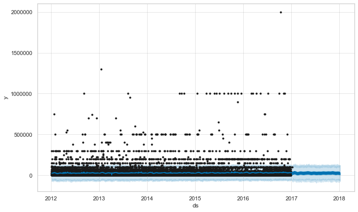
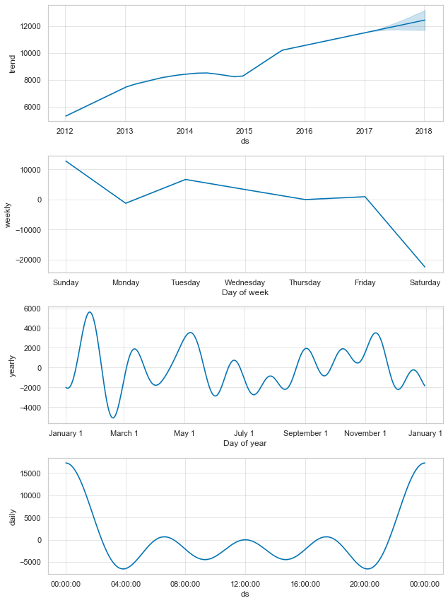
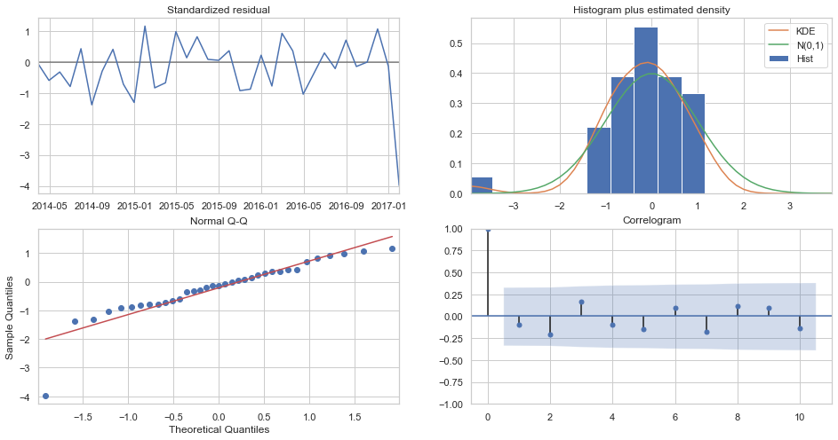
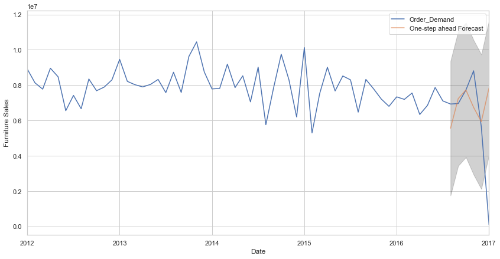

world wide products
==============================

Time series forecasting

# World Wide Products Inc.

### product demand forecasting - Project 4

#### Submitted by: Mugdha Bajjuri

The dataset contains historical product demand for a manufacturing company with footprints globally. The company provides thousands of products within dozens of product categories. There are four central warehouses to ship products within the region it is responsible for.

This dataset contains 1 CSV file.

Product_demand.csv - CSV data file containing product demand for encoded product id's

I have used two models, FbProphet and ARIMA to determine the demand for a product using the other columns as features.

## Exploratory Data Analysis :

##### products with highest demand
##### Order demand over the years
##### Demand for Product 1359 over the years

## Forecasting Models

### FbProphet Model

### Observations :

Looking at the various forecasting plots derived from fbProphet model, for Product_1359 
following observations can be made:

Demand for the product_1359 is increasing from 2012 to 2018 with a small dip from 2014 to 2015.

Considering yearly trend, there is a sharp increase in demand between January to March

Considering weekly trend, demand is high on sundays and then goes to negative on saturdays
    

# ARIMA Model

SARIMAX,  is used to model and predict future points of a time series.

ARIMA component is used to fit time-series data to better understand and forecast future points in the time series.

